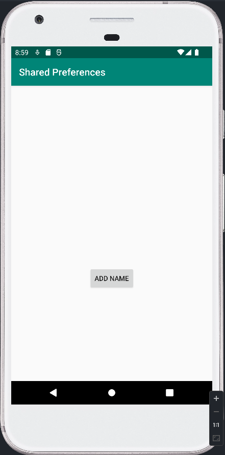
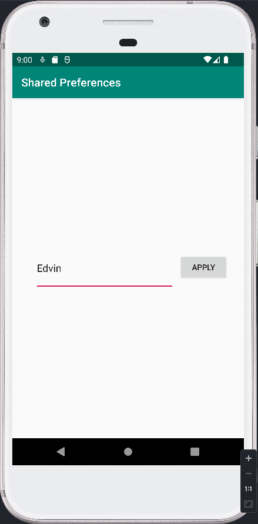
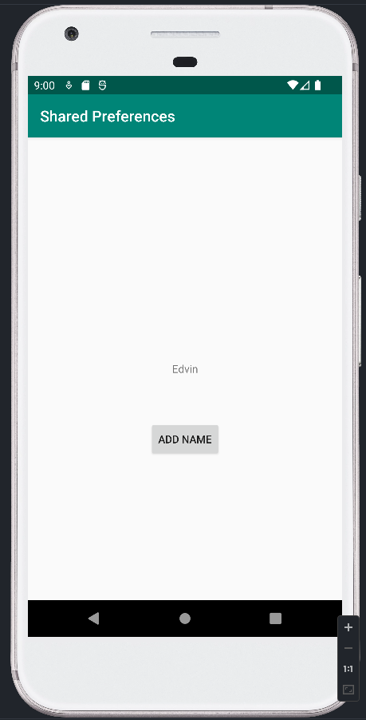

# Shared Preferences

I denna uppgift fick vi i uppdrag att skapa en app där användaren kan skriva in ett namn i en editText och få en vanlig textview att visa namnet. Detta görs med hjälp av shared preferences.
Först av allt forkade och klonade jag projektet från LenaSYS github sida och öppnade projektet med android studio. Efter det skapade jag en till aktivity vid namn SecondActivity.java där jag lade till knappen buttonSend och editText editTextAddName. Dessa widgets kommer lagra och skicka datan från användaren och kommer sedan skrivas ut i en textView i MainActivity.java.
För att nå dessa knappar i SecondActivity behöver användaren trycka på knappen buttonSendSecond (Add name) som tar användaren till den andra aktiviteten. 

För att komma tillbaka till MainActivity ska användaren skriva in sitt namn i editText, som kommer lagra värdet i arrayen sharedPrefString, och trycka på "Apply"-knappen (buttonSend). 

Detta görs genom att hämta värdet från editViewAddName och anger värdet hos addName. Värdet läggs sedan till i sharedPrefString och anger sedan värdet för editText i MainActivity.
